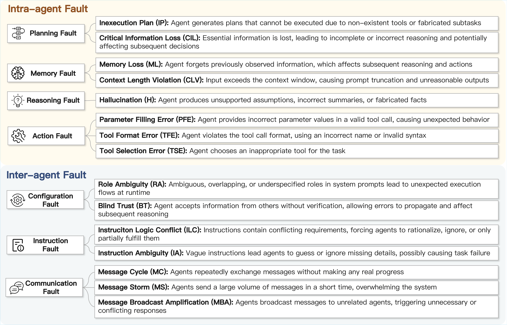

# Multi-Agent System Fault Injection & Tolerance

## Project Overview

Study of **fault injection, classification, and tolerance** in multi-agent systems, comparing robustness across models and frameworks.

## Core Research Objectives

1. **Fault Injection**: Design injection methods
2. **Fault Taxonomy**: Define fault types
3. **Tolerance Evaluation**: Measure recovery under faults
4. **Model Comparison**: Compare DeepSeek-v3 vs GPT-5

## Project Structure

```
MASFIRE/
├── data/                           # Main data directory
│   ├── Camel/                      # CAMEL multi-agent framework test results
│   │   ├── deepseek-v3/            # DeepSeek v3 model results
│   │   │   ├── baseline/           # Baseline tests (without fault injection)
│   │   │   └── injection/          # Fault injection tests
│   │   └── gpt-5/                  # GPT-5 model results
│   │       ├── baseline/
│   │       └── injection/
│   │
│   ├── Metagpt/                    # MetaGPT multi-agent framework test results
│   │   ├── deepseek-v3/
│   │   │   ├── baseline/
│   │   │   └── injection/
│   │   └── gpt-5/
│   │       ├── baseline/
│   │       └── injection/
│   │
│   ├── Table-Critic/               # Table-Critic framework test results
│   │   ├── deepseek-v3/
│   │   │   ├── baseline/
│   │   │   └── injection/
│   │   └── gpt-5/
│   │       ├── baseline/
│   │       └── injection/
│   │
│   ├── camel.csv                   # CAMEL framework test results 
│   ├── metagpt.csv                 # MetaGPT framework test results 
│   ├── tablecritic.csv             # Table-Critic framework test results summary
│   └── tag.csv                     # Fault labels and fault tolerance mechanism classification 
└── images/  
```

## Key Datasets

### 1. Testing Frameworks

| Framework | Description |
|-----------|-------------|
| **CAMEL** | Multi-agent collaboration | 
| **MetaGPT** | Large-scale workflows | 
| **Table-Critic** | Table QA & validation |

### 2. LLM Models

- **DeepSeek-v3**: Open-source
- **GPT-5**: Commercial

### 3. Test Modes

- **Baseline**: No fault injection
- **Injection**: With faults

## Runtime Dependencies & Dataset Preparation

Align runtime dependencies with upstream projects:

- Table-Critic: https://github.com/Peiying-Yu/Table-Critic
- MetaGPT: https://github.com/FoundationAgents/MetaGPT
- CAMEL: https://github.com/camel-ai/camel

For WebShop dataset preparation:

- WebShop: https://github.com/princeton-nlp/webshop

## Benchmark Testing

### Benchmark Overview

Three benchmarks cover code generation, table QA, and web interaction.

### 1. MetaGPT - HumanEval (Code Generation)

**Framework Characteristics**: Large-scale system, 2–4 agents

**Task Description**: Competitive-programming style code generation
**Total tasks**: 164

**Baseline Performance (Without Fault Injection)**:

| Model | Success Rate | Sample Count |
|-------|--------------|--------------|
| **GPT-5** | 99% | 161 |
| **DeepSeek-v3** | 89% | 146 |


### 2. Table-Critic - WikiTQ (Table Question Answering)

**Framework Characteristics**: Medium-scale, fixed 5-agent workflow

**Task Description**: Table QA
**Total tasks**: 400 (test split)

**Baseline Performance (Without Fault Injection)**:

| Model | Success Rate | Sample Count |
|-------|--------------|--------------|
| **GPT-5** | 87% | 348 |
| **DeepSeek-v3** | 78.25% | 313 |

### 3. CAMEL - WebShop (Web Shopping)

**Framework Characteristics**: Simple-scale, 2 agents

**Task Description**: Web shopping interaction
**Total tasks**: 251 (annotated by AgentBoard: https://github.com/hkust-nlp/AgentBoard)

**Baseline Performance (Without Fault Injection)**:

| Model | Success Rate | Sample Count |
|-------|--------------|--------------|
| **GPT-5** | 37.8% | 95 |
| **DeepSeek-v3** | 33.0% | 83 |

**Benchmark Design Characteristics**:
1. **Multi-domain Coverage**
2. **Agent Scale Variance**
3. **Difficulty Hierarchy**
4. **Standardized Benchmarks**
5. **Baseline + Injection**

## Fault Classification Framework

### Fault Classification System Documentation



Based on the classification system, the project identifies and categorizes faults that occur within and between agents in multi-agent systems.

The project assesses system fault tolerance capabilities across four distinct dimensions:

### Fault Tolerance Dimensions

1. **Mechanism-Level FT**
   - Fault tolerance derived from the system's structural design and temporal redundancy mechanisms
   - Includes architectural features such as iterative critique loops, multi-agent voting schemes, and redundant execution paths
   - These mechanisms operate independently of agent reasoning and are embedded in the MAS coordination infrastructure

2. **Rule-Based FT**
   - Fault tolerance emerging from explicit procedural logic and heuristic rules encoded in the MAS implementation
   - Includes automatic message deduplication and other deterministic behaviors
   - Activates when predefined conditions are met, regardless of the underlying model's reasoning capabilities

3. **Prompt-Level FT**
   - Rooted in the semantic robustness of user prompts
   - Leverages prompt engineering to guide agents through edge cases, clarify ambiguities, and maintain role boundaries
   - Pre-empts and mitigates faults through careful prompt design

4. **Reasoning-Level FT**
   - Driven by the agent's high-level cognitive reflection
   - Relies on the underlying model's semantic understanding to autonomously detect logical inconsistencies
   - Infers missing context and resolves conflicts through multi-agent debate and consensus-building

### Tolerance Results

- **Success**: The system can effectively handle faults
- **Failure**: The system cannot handle faults, resulting in task failure

## Dataset Details

### camel.csv
- **Fields**: Test System, Base Model, Failure Type, Task ID, Agent Behavior Category, Task Result
- **Model Coverage**: deepseek-v3, gpt-5
- **Fault Types**: Blind Trust and multiple other types
- **Task Results**: PASS/FAIL

### metagpt.csv
- **Fields**: Similar to camel.csv
- **Characteristics**: Comprehensive test results for MetaGPT framework

### tablecritic.csv
- **Fields**: Similar to camel.csv
- **Characteristics**: Comprehensive test results for Table-Critic framework

### tag.csv
- **Fields**: Fault Category, Agent Behavior, Fault Tolerance Summary
- **Characteristics**: Provides mapping relationships between fault classification and tolerance mechanisms
- **Purpose**: Maps each fault type and agent behavior to specific fault tolerance dimensions


## Fault Injection Methods

### Detailed Fault Injection Methods Documentation


### Injection Strategies

1. **Prompt Modification**
   - Introduce ambiguities in system prompts
   - Add contradictory instructions
   - Hide critical information

2. **Input Contamination**
   - Mix incorrect information in inputs
   - Modify parameter values
   - Remove critical data

3. **Intermediate Process Interference**
   - Intercept agent-to-agent communication
   - Modify message content
   - Simulate faulty responses


### Injection Dimensions

The project injects faults across multiple dimensions to comprehensively evaluate fault tolerance:

1. **Fault Type Dimension**: Role ambiguity, instruction ambiguity, hallucination, blind trust, etc.
2. **Tolerance Level Dimension**: Mechanism-level, rule-based, prompt-level, reasoning-level tolerance
3. **Framework Dimension**: Different multi-agent frameworks (CAMEL, MetaGPT, Table-Critic)
4. **Model Dimension**: Different LLM models (DeepSeek-v3, GPT-5)


## Key Findings and Applications

### Research Outcomes

1. **Model Difference Analysis**
   - Different LLMs show varying sensitivity to faults
   - Relative advantages in fault tolerance capabilities

2. **Framework Comparison**
   - Design characteristics of various multi-agent frameworks
   - Effectiveness of built-in tolerance mechanisms

3. **Fault Pattern Recognition**
   - Identification of common agent failure patterns
   - Correlation among fault types

### Application Value

- **System Design**: Guide robust design of multi-agent systems
- **Model Evaluation**: Provide references for LLM selection
- **Tolerance Optimization**: Improve system fault handling capabilities
- **Risk Assessment**: Identify potential risks in production environments

